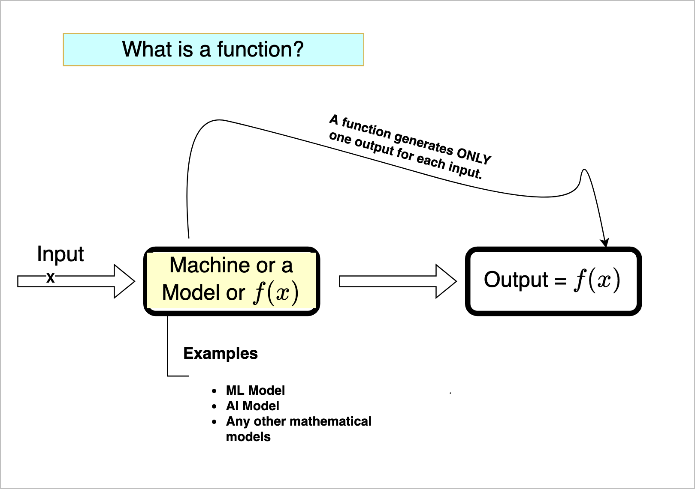
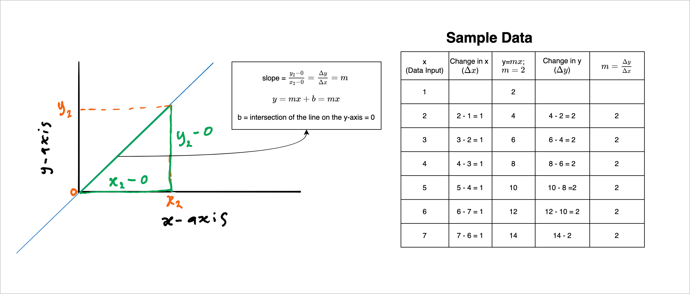

# What is a function?

We define a function as a rule that generates one output for each input in a given set. It is not a function if you can get more than one output for any input to the system.

 ||
| :-----------------------------------:|
| <b> Fig 1. Function Definitions.</b>|


In figure 1-1, we say the input, x, maps to the output under f.
$$
x \mapsto output \\
$$

### Some useful definitions

**Domain**: This is the set of all possible inputs to a function. We can denote this set as D in our case. 

**Co-domain**: This is the set of values from which the output to a function can be drawn.

**Image**: This is the set of actual output that a specific function can generate from the co-domain.

$$
f:D\rightarrow F
$$

A function, $f$, that maps inputs in set $D$ to actual output (image) in set $F$. 

**Forward problem**: Given an element $a$ in set $D$, compute the image of $a$ in set $F$ under $f$.

**Backward problem**: Given an element $t$ in the co-domain $F$, compute the corresponding value in the domain $D$ under $f^{-1}$. This type of problem is also known as the **inverse problem**.

**Linear combination**: This is the addition of various *proportions* of different *variables*. For example, if you have a stock portfolio of COP, AAPL, ENB, and MSFT, the value of your investment is a linear combination of each of these stocks. 


$$
\text{value of your investment} = a \times COP + b \times AAPL + c \times ENB + d \times MSFT
$$

Where a, b, c, and d represent the proportion of their corresponding stock.


## Linear function
A function is linear if a decrease or increase in the input by a constant amount leads to a constant increase or decrease in the output. This constant amount is formally known as the **slope**.

 ||
| :-----------------------------------:|
| <b> Fig 2. Slope of a line.</b>|

### Implementation of a linear function 
```python
import numpy as np
x = np.array([1,2,3,4,5,6,7])
y = 2*x

change_in_x = np.diff(x)
change_in_y = np.diff(y)

slope = change_in_y[0] / change_in_x[0]

print(f"Change in x: {change_in_x}\nChange in y: {change_in_y}\n\
The slope m of the equation is {slope}")

# output
Change in x: [1 1 1 1 1 1]
Change in y: [2 2 2 2 2 2]
The slope m of the equation is 2.0
```