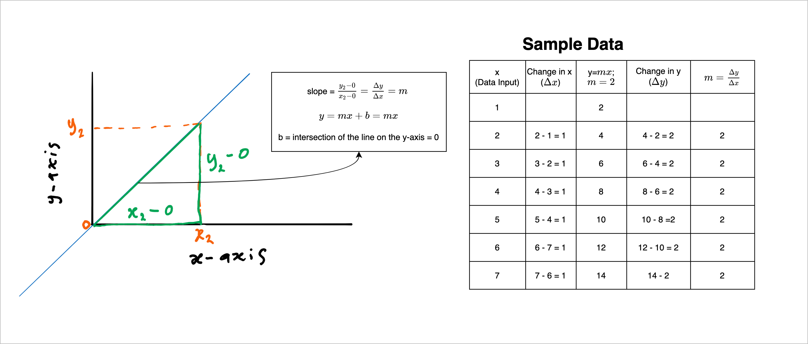

# Backpropagation
Backpropagation is at the heart of modern deep learning algorithms. We only care about two values in each unit of a neural network:
1.  Weights of the connection. We can change this as we please.
2.  The output of a neuron. The output is calculated automatically with a given input to the network.
Suppose we do not complicate things with **activation functions**. In that case, every change in a neuron's output is proportional to its input or connection weights. Since the input is beyond our control, the only way for the output to change is to change the weights. Thus we can assess how a change in output will affect network error by looking at the changes in the connection weights. The connection between a change in a neuron's output and the resulting change in the network error is the change in the output of a neuron multiplied **by some number,** termed **delta.**

$$
\Delta Error = \Delta \text{Neuron's output}\times \delta
$$

where $\delta$ = **node delta** for each neuron.
Backpropagation is all about finding a delta for each neuron. Since we need to propagate this proportion of errors backward to all neurons, we will need to start the output layer from the network's end. This process of back-propagating is akin to making sure that we adjust the parameter at each neuron according to how much they contribute to the error. As you can tell, we care about different things when we are propagating forward and when we are propagating backward (fig. 1).

 ||
| :-----------------------------------:|
| <b> Fig 1. Backward and forward propagation in a 3-layer neural nework.</b>|

One inefficient way of backpropagating the error is to manually increase or decrease or keep the weights in the network constant. We do this by freezing all weights except for the one we want to change. Every change we make to the selected weight has a ripple effect on everything connected to it. We recalculate the error to see how we are doing. If the error is less than the previous error, we keep this change. Otherwise, we undo the change. Then we pick another weight at random and go through the same process until we have modified all the weights for a sample. We then repeat the whole process for every example in the training set. This is one epoch. We continue this process until we reach a certain number of epochs or until the training set error is a 'minimum.'

The problems with this approach are:

1.  There is no telling when we will be done.
2.  We do not know whether we should add or subtract or keep each weight constant.
3.  Any change we make to one weight may affect the other.

The above brute force approach is not practical. The next session will detail how we can update network weights efficiently.

## Various Forms of Error
The last calculation, as shown in the network above, is the total error. There are various forms of these error functions.

1. Mean Squared Error (MSE)

 ||
| :-----------------------------------:|
| <b> Fig 2.  Mean Square Error.</b>|

2. Squared Error (SE)

$$SE = \frac{1}{2}\sum_{i=1}^n(t_i - z_i)$$

3. Root Mean Squared Error (RMS)
$$
MSE = \sqrt{\frac{1}{n}\sum_{i=1}^n(t_i-Z_i)^2}
$$

4. Sum of Squared error
$$
SSE = \sum_{i=1}^n(t_i-Z_i)^2
$$

5. Cross-entropy 

$$
cross-entropy = \sum_{p=1}^{m}\sum_{j=1}^{n}t_{pj}\times log_2(y_{pj}) + (1-t_{pj})\times log_2(1-y_{pj})
$$

$p$ is the number of samples, and $j$ is the number of outputs for each sample.

We use the error delta to adjust the output of each neuron up or down depending on which direction will reduce the error, E.Technically for us to be able to calculate the gradient, the error curve, which we have carefully chosen, must not have the three properties below:

1.  The curve must have a single output for each input. The curve must not turn on itself; otherwise, there will be confusion around which gradient to use.

 ||
| :-----------------------------------:|
| <b> Fig 3a. An error curve turning on itself, resulting in two output values for a given input..</b>|

2. The error curve must be continuous and smooth. That is, we can draw the curve without lifting the pen off the page, and there must not be sharp edges.

 ||
| :-----------------------------------:|
| <b> Fig 3b.  An error curve with a sharp corner (cusp) and discontinuity.</b>|

The problem with the above two error curves is that we do not know which gradient to use to update the weights. Once we have the error curve, it is straightforward to compute the error. Let us take our previous network with two outputs (fig. 1). The output of this network is binary - Yes/No or 1/0, making the network a binary classification. For binary classification, the error function is cross-entropy, which is stated below for convenience.

The outputs of the last layer give us the probability $P_1$ that the input falls in class 1, and $P_2$  that the input belongs to class 2.  $P_1$  or $P_2$  is equal to 1 when error = 0. For example, if the network is certain that the input belongs to class 1, $P_1 = 1$   and $P_2 = 0$ . If the network is less certain, $P_1$  could be 85% and $P_2$  15%.

An error, in this case, is a single number that expresses how well we are doing. We can do this by comparing $P_1$  & $P_2$  to their corresponding labels. We will need to one-hot encode the classes. For each example or row of 'data, we will create a list of zeros whose length is the same as the number of classes. In this example, the length of the list = 2 because we have two classes. For each list of zeros, replace zero with 1 to indicate which class the example belongs to. For example, if a sample belongs to class 1, the one-hot encoded class will be [1, O].

The next step is to compare the label with the probability. We typically use cross-entropy for this purpose, as stated above. We will get into details of 1) how we will arrive at the cross-entropy equation and 2) how we will calculate delta using the cross-entropy equation. For now, we need two numbers :

1. The total error, E
2. The error gradient. The error gradient tells us how much the error will change if we change any inputs to the error function.

## What is Gradient Descent?
We can double the training speed if we know which direction to nudge the weights based on the error. We can get this information by computing the error gradient with respect to the weight of interest. This gradient points to the direction of the steepest descent. We have to turn around and go in the opposite direction to the gradient to minimize the error.

Gradient means slope. Decent means going down something. Therefore, gradient descent has something to do with descending a slope. A few questions come to mind as a result of this unpacking.

1.  What are we descending?
2.  What is the slope?
3.  How fast or slow should we descend that thing?

With gradient descent, we descend the slope of the gradients to find the lowest point. These gradients are the error of the individual weights. The goal of the network is to minimize these errors.

 ||
| :-----------------------------------:|
| <b> Fig 4a.  An error curve with a global minimum.</b>|

The problem with the above figure is that it is straightforward how we get to the lowest error. Our path is not bumpy. In real life, though, our path is fraught with potholes, such as depicted in the figure below.

 ||
| :-----------------------------------:|
| <b> Fig 4b.  An error curve with a local minimum.</b>|

All we want to do is to avoid the deepest potholes. But if there are so many potholes, we may encounter what we think is the 'deepest' pothole without realizing this is not the case. This 'deepest' pothole is what we call a local minimum problem. A local minimum is a potential pitfall when using gradient descent. As a result, gradient descent is often paired with an optimization algorithm such as **momentum.** The momentum goal is to add some power to the gradient descent algorithm to push the point outside the local minimum. Other optimization algorithms are:

1.  Adagrad
2.  Adadelta (Adagrad extension)
3.  Nesterov Accelerated gradient (fine tunes momentum)
4.  RMSprop
5.  Adam Sebastian Ruder article on gradient descent

Sebastian Ruder presents an excellent overview of these optimization algorithms in [An overview of gradient descent optimization algorithms.](https://paperswithcode.com/paper/an-overview-of-gradient-descent-optimization)

The tangent line to a curve at a specific point on that curve defines the gradient at that point. The Greeks referred to this as the kissing line. One way to get this kissing line is to move two points on either side of a target point towards that target point. A line is drawn at the instance the three points collapse into one. This is the tangent line at that target point. The slope or the steepness of the line depends on the shape of the curve at that point.

The slope or steepness of a tangent line is zero if the target point is the minimum or maximum for that curve (fig. 5). In these cases, the tangent line is horizontal, as shown in the figure above. A vertical tangent gives an infinite slope.

 ||
| :-----------------------------------:|
| <b> Fig 5.  The gradient at the lowest and highest pint on a convex or concave curve..</b>|

As depicted below, the slope or the gradient measures how much the output (y values) changes as the input (x-axis) changes by a certain amount.

 ||
| :-----------------------------------:|
| <b> Fig 6.  A simple calculation of a slope or gradient.</b>|

Back to our network in fig. 1, the gradient at node $B_1$ is given as:

$$\begin{align}
gradient_B = \frac{C_{1c}}{B_{1c}} \\ 
C_{1c} = gradient_B \times B_{1c}
\end{align}$$

We can express the above equation in words. The change in a node in the L+1 layer is the product of the change in a connecting node in the L layer and the gradient at the same node in the L layer. In the above equation: $C_{1c}$ = change in $C_{1}$; $B_{1c}$ = change in the preceding $B_{1}$ node; and $gradient_B$ is the gradient at node B. This is where we need to have a single gradient for a single input. Those properties of a bad curve that we mentioned earlier ensure this condition is met.
Let us switch our attention back to the simple network above. We can compute the change in error $E_c$ as a result of changes in the output of a neuron as follows:

$$
E_{c} = C_1\delta \times C_{1c}
$$

||
| :-----------------------------------:|
| <b> Fig 7.  Shows how a change in the output node leads to a change in the total error.</b>|

If both $C_1\delta$ and $C_{1c}$ are of the same sign, the error will increase when $C_1$ changes by $C_{1c}$.
Backpropagation is all about finding the delta (= gradient) at each note as depicted in the network. We will begin our exploration at the output layer and backpropagate the contribution of each node. Let us assume our error curve is as shown below.

 ||
| :-----------------------------------:|
| <b> Fig 8.  3D error surface and contour plots of the error surface formed by both P1 and P2</b>|

Whenever we focus on a parameter, we are slicing the error cube at a point where the other parameter(s) is constant (fig. 9).

 ||
| :-----------------------------------:|
| <b> Fig 9.  The 3D surface is sliced at P2 = 0.</b>|

In the above figure, the gradient is negative. That is if we increase $P_1$, the error will decrease. We move in the opposite direction to the gradient. We follow the step below to adjust the value of $P_1$:

We calculate the gradient at the first point and subtract it from $P_1$. Remember, the gradient is negative, so multiplying the gradient by -1 will take us in the opposite direction to the gradient. The flipped gradient is what we add to $P_1$. This process is the same as subtracting the gradient from $P_1$.

$$
P_1^{new} = P_1^{old} - \frac{\partial E}{\partial P_1}
$$

We will again find the gradient at the new point above. This new gradient accurately tells us what happens to the error as we move from (1) to (2) on the curve above. As long as we do not move too far from one point on the curve to another, we will certainly know what happens to the error. We can also plot the error curve for $P_2$ as shown below:

 ||
| :-----------------------------------:|
| <b> Fig 10.  A plot of the error as a function of P2.</b>|

A great visuals of how the gradient is calculated at selected points on the curve can be seen from Sendtex [Neural Network from Scratch](https://nnfs.io/ animation below.

<iframe width="560" height="315" src="https://www.youtube.com/embed/NcKiZhRDmmA" title="YouTube video player" frameborder="0" allow="accelerometer; autoplay; clipboard-write; encrypted-media; gyroscope; picture-in-picture" allowfullscreen></iframe>

Figure 11 shows what it looks like as we traverse the terrain from the highest point to the lowest point.

 ||
| :-----------------------------------:|
| <b> Fig 11.  Traversing the terrain from the highest point to the lowest point.</b>|

Few things to note in figures 9 and 10:

1.  The two curves are at different values at the bottom of the curve.
2.  The gradients are of different signs in both cases. That is, the gradients that we chose to show are on different sides of the curves.
3.  We cannot get a zero error. The error, in this case, cannot get lower than a particular value.

We will especially not get a zero error because we are changing one value at a time while we keep the other value constant. In other words, even if we get $P_2=0$, where the error is minimum, $P_1$ will not be at the correct value to reduce the error.

Fortunately, our goal is not to get a Zero error. Our goal is to reduce the error as much as we can. We can theoretically get a Zero error, but the resulting model will overfit or not generalize. In other words, our model will not perform well with data it has not seen before.

## Finding Deltas for the Output Neuron
To calculate delta in the output layer, we use the mean square error function as our error function. Ideally, we use cross-entropy for error, as mentioned earlier. The MSE error that we are using here is just for us to keep things simple to see what is going on. The figure below focuses on the $C_1$ node in the output layer and the connecting $B_1$  node in the preceding layer. Our task here is to update the connection weight, $w_5$.

 ||
| :-----------------------------------:|
| <b> Fig 12. </b>|

The figure above shows that the output node delta is the difference between the $C_1$ or $P_1$ and the corre­ct label, $t_1$. We update the connection weight, w_5, between the output neuron and the immediate layer before subtracting the product of the output node delta and the node before the output node.

$$
w_5^{new}= w_5^{old} - (C_1{\delta} \times B_1^{output})
$$

We can apply the same reasoning to update all of the weights connecting output layer nodes to all nodes in the layer before the output layer. The next logical step is to find out how to update the connecting weights for nodes not connected to the nodes in the output layer.
Let us break down what we are observing in the figure below. If we read the figure from left to right, the change to $B_1$ is $B_{1c}$ is multiplied by $w_5$ and added to $C_1$ to get the new value $C_1^{new}$. The change in C, $C_{1c}$ is calculated as in the figure below.

 ||
| :-----------------------------------:|
| <b> Fig 13. </b>|

We now have a chain of operations from neuron B to the error, E. So the change in error is a product of the change in B and the node delta at node B. However, we still need to find B_{1}\delta, which has contributions from nodes C_1and C_2. Therefore,

$$\begin{align}
B_1{\delta} = B_1{\delta}^{C_1} + B_1{\delta}^{C_2} \\ = (w_5 \times C_1\delta) + (w_6 \times C_2\delta)
\end{align}$$

Note that neuron C has disappeared from the change in error due to a change in input from Node B. We will follow the same process to find the change in the error due to a change in any of the neurons in the network! Amazing! Easy peezy! Here is what happened in a nutshell:

 ||
| :-----------------------------------:|
| <b> Fig 14. </b>|

What this shows is that calculating node output is almost as efficient as calculating node delta. The process of finding the delta for every neuron in the network is the heart of the backpropagation algorithm.

One important point to note is that we have not used activation functions in our discussion so far. We have also not mentioned the chain rule, which is how node deltas are computed in deep learning. We could see what is going on without the distraction of the so many symbols in chain rule and co. Now we can introduce chain rule and be able to see what those symbols represent clearly. 

## Backpropagation with Chain rule
Let us show our network with a few annotaion (fig. 15). Figure 16, focuses on the $B_1$ node that we want to update its connecting weight, $w_5$ to ouput node $C_1$

 ||
| :-----------------------------------:|
| <b> Fig 15. </b>|

 ||
| :-----------------------------------:|
| <b> Fig 16. </b>|

$$
\frac{\partial E}{\partial w_5} = \frac{\partial E}{\partial C_1} \times \frac{\partial C_1}{\partial netc1} \times \frac{\partial netc1}{\partial w_5}
$$

 ||
| :-----------------------------------:|
| <b> Fig 17. </b>|

$$\begin{align}
\frac{\partial E}{\partial C_1} = -(t-P_1) \\ \\
\frac{\partial C_1}{\partial netc1} = P_1(1-P_1) \\ \\
\frac{\partial netc1}{\partial w_5} = outb1 \\ \\
C_1\delta = -(t-P_1) \times P_1(1-P_1) \\ \\
\frac{\partial E}{\partial w_5} = C_1\delta \times outb1
\end{align}$$
$outb1$  = output of node $B_1$.

### What about $bw_3$?
$$\begin{align}
\frac{\partial E}{\partial bw_3} = \frac{\partial E}{\partial C_1} \times \frac{\partial C_1}{\partial netc1} \\ \\
= -(t-P_1) \times P_1(1-P_1) = C_1\delta
\end{align}$$

### Partial Derivative of Hidden Layer Weights

 ||
| :-----------------------------------:|
| <b> Fig 18. </b>|

$$
\frac{\partial E}{\partial w_1} = [(\frac{\partial E}{ \partial C_1} \times \frac{\partial C_1}{\partial netc1} \times \frac{\partial netc1}{\partial outb1}) + (\frac{\partial E}{ \partial C_2} \times \frac{\partial C_2}{\partial netc2} \times \frac{\partial netc2}{\partial outb1})] \times \frac{\partial outb1}{\partial netb1} \times \frac{\partial netb1}{\partial w_1}
$$
The summation in the square bracket is because we have contributions from two output neurons. So, we need to sum those contributions up.

 ||
| :-----------------------------------:|
| <b> Fig 19. </b>|

||
| :-----------------------------------:|
| <b> Fig 20. </b>|

$$
\frac{\partial E}{\partial w_1} = \delta_{b_1} \times outa1
$$

### What about $bw_1$?
$$
\frac{\partial E}{\partial bw_1} = \delta_{b_1}
$$
