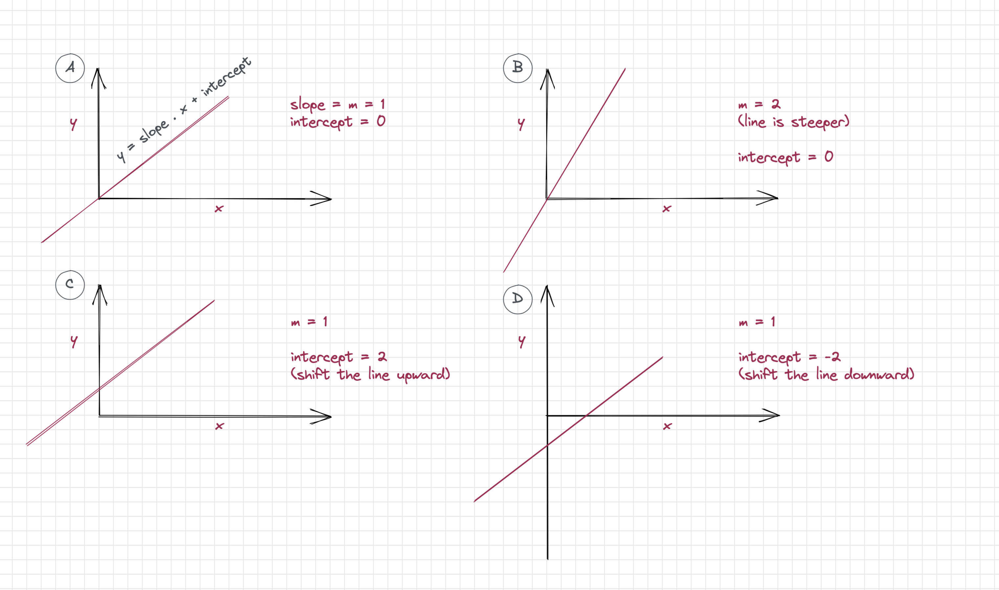

## Our Biological Neuron

At a high level, our biological neuron works by taking electrical signals from other neurons, summing them up, and comparing the sum to a **threshold.** The particular neuron, in this case, sends the signal (the neuron fires) to the next neuron if the sum is higher than the threshold. No signal is sent (the neuron does not fire) if the sum is less than the threshold. The neuron receives the electrical signals from other neurons through the **dendrites** and sends them along the **axon** to other neurons. 

|  |
| :-----------------------------------:|
| <b> Fig 1-1 A bilological neuron from  Glassner A. Deep Learning: A Visual Approach</b>                                    |


# Artificial Neuron

The oversimplified description of our biological neuron motivated researchers to express this abstraction in mathematical form. Rosenblatt (1957) proposed such an _oversimplified_ mathematical model of a neuron called **perceptron** (figure 1-2). The input layer to a perceptron consists of four neurons/units ( $x_1, x_2, x_3, x_4$). There is only one output neuron. Each of the connections between input neurons and the output is weighted by _w_. The value that reached the output neurons is the sum ( $\sum$ ) of the product of this weight and the corresponding input. The output neuron fires ( sends 1) if the value or $\sum$  at the output neuron is greater than or equal to zero. Otherwise, the output neuron does not fire (sends 0).

 ||
| :-----------------------------------:|
| <b> Fig 1-2 A perceptron with four inputs.</b>|


The perceptron can implement any ideas expressed using mathematical logic. Computers operate through a combination of transistors in various configurations called logic gates, mainly **boolean logics (**OR, AND, NOT XOR). We can use perceptron to simulate these logic gates. For example, let us use perceptron to simulate a AND logic gate (figure 1-3).

 ||
| :-----------------------------------:|
| <b> Fig 1-3 Implementation of a AND logic gate using a perceptron.</b>|

```python
test_inputs = [(0, 0), (0, 1), (1, 0), (1, 1)]
correct_outputs = [False, False, False, True]
outputs = [] # container to store the output

# Set weight1, weight2, and bias
weight1 = 2.0
weight2 = 2.0
bias = -4.0

# Generate and check output
for test_input, correct_output in zip(test_inputs, correct_outputs):
    linear_combination = weight1 * test_input[0] + weight2 * test_input[1] + bias
    output = int(linear_combination >= 0)
    is_correct_string = 'Yes' if output == correct_output else 'No'
    print(f"input 1 & 2: {(test_input[0], test_input[1])}; linear_combination: {linear_combination};  predicted output: {output};  is_correct_string: {is_correct_string}") 
	
# output
input 1 & 2: (0, 0); linear_combination: -4.0;  predicted output: 0;  is_correct_string: Yes
input 1 & 2: (0, 1); linear_combination: -2.0;  predicted output: 0;  is_correct_string: Yes
input 1 & 2: (1, 0); linear_combination: -2.0;  predicted output: 0;  is_correct_string: Yes
input 1 & 2: (1, 1); linear_combination: 0.0;  predicted output: 1;  is_correct_string: Yes
```

# Modern Artificial Neuron

Unfortunately, many real-life problems cannot be separated by a straight line. The original perceptron, now called **a neuron**, was tweaked in two minor ways to make them perform as they do today.

1.  A bias term is added to each perceptron. 
2.  We use a mathematical function instead of a threshold of zero

In figure 5, the step function receives the neuron's output or **activation** and returns 0 or 1. Such mathematical functions are broadly referred to as the activation functions because they operate on the activation/ouput of a neuron. We will revisit activation functions in the next chapter.


**Continue from here**

# The Perceptron Algorithm

The perceptron learning algorithm is also called **a supervised learning algorithm.** The model is presented with the correct answer or output in supervised learning. The model uses the output to figure out how to go from input to the corresponding output. The steps for one sample is as follows:

1.  Pick random weights for $w_0, w_1, ..., w_n$. Where $w_0$ = weight of the bias term and $w_1$ to $w_n$ be the weights of the corresponding inputs
2.  Pick one sample/example from n datapoints.
3.  Augment the input vectors with a bias term = 1. That is add 1 to the beginning of the input vectors. That is $x_0$ =1
4.  Compute the score z using the input $x_0$ to $x_n$ 
5.  Pass the score through an activation function (e.g sign or step functions)
6.  if the output is different from the ground truth or label
	1. If y < 0, add (**learning_rate * $x_i$) from each $w_i$** for each i
	2. If y > 0, substract (**learning_rate * $x_i$) to each $w_i$** for each i
7.  Repeat steps 2 - 6 until perceptron predicts all examples correctly


In the previous example, we applied the right weight to each input to get the correct output without explaining how we got those weights. In the following example, we will use the perceptron algorithm outlined above to arrive at the correct output for each sample. The goal is to explain how we arrive at the right weights for each input. Consider the previous four sample data points with two inputs per sample. The inputs are also known as **features**. The two inputs make a **feature set**, which is represented by a vector - **feature vector**. The values in a feature set make a **sample**. Samples are what we feed the neuron.  The first feature set in the previous example is (0, 0). Each element in this feature set is a feature. The feature set values (zeros) make a sample. 

Before we proceed to implement the Perceptron Algorithm, let us remind ourselves of our high school math. We have all seen the equation of a line expressed as follows:

$$y = mx + c \Rightarrow \text{equation of a straight line.}$$

where m = slope or gradient; x = input, and c = intercept. The slope determines whether the line is vertical, horizontal, or at an angle to the x-axis. The line becomes steeper (more vertical) as the value of m increases (figure XX B). It becomes gentler as we decrease the value of m (figure XX A). 

The intercept is the value on the y-axis where the line touches the y-axis— x=0 at the intercept. The bias term is a knob that we can use to shift the straight line up and down the vertical y-axis since the intercept is always a value on the y-axis (figures XX C & D). 

Imagine turning the slope and intercepts knobs until you find a line where data points of the same type fall above the line and those of another types below the line. This is excatly what we are going to do to solve the AND logical problem using the perceptron algorithm. The below video shows the process visually.




<iframe width="560" height="315" src="https://www.youtube.com/embed/SRAFVJ5UbB0" title="YouTube video player" frameborder="0" allow="accelerometer; autoplay; clipboard-write; encrypted-media; gyroscope; picture-in-picture" allowfullscreen></iframe>

  We are now ready to implement the perceptron algorithm. To make the mathematical symbol more compact, we will fold the bias term into the feature vector. Fold here means add to feature vector.  We will add 1 as the bias value to the beginning of every feature vector to make the math compact.
  
  $$\begin{align}
  \sum_{i=0}^{i=2} w_ix_i =0 \\
  w_0x_0 + w_1x_1 + w_2x_2 =0 \\ 
  
  \text{where} \ w_0 = \text{bias weight}\\
  and \ x_0=\text{bias value} = 1
 \end{align}$$
 
If we did not add bias to the feature vector, we would have written the equation as follows:
$$\begin{align}
  y = \left(\sum_{i=1}^{i=2} w_ix_i \right) + bias
 \end{align}$$

Note that the slope is the weight, w, and the intercept is the bias.

```python
# Augment the input vector with bias = 1 as the first element in the vector.
# two inputs and one bias as input = three inputs in total 
inputs = [(1,0, 0), (1,0, 1), (1,1, 0), (1,1, 1)]
correct_outputs = [False, False, False, True]

# convert each sample to numpy array
input_train = [np.array(item) for item in inputs] # shape = 4 x 3
# convert boolean outputs into their integer equivalent
label = [int(item) for item in correct_outputs]

# extract the input (x1) and input (x2) from the input array
x1 = [item[1] for item in input_train]
x2 = [item[2] for item in input_train]
```

Let us plot the input on a a grid.

```python
import plotly.graph_objects as go
# Plot the data points
fig = go.Figure()
# fig.add_trace(go.Scatter(x=x1, y=x2, fill='tozeroy', line_color = 'red', mode='lines'))
fig.add_trace(go.Scatter(x = x1[:3], y =x2[:3], mode ='markers',
                    marker = dict(color ='black', size = 20), name = 'False'))
fig.add_trace(go.Scatter(x = x1[3:], y =x2[3:], mode ='markers',
                    marker = dict(color ='green', size = 20), name = 'True'))
fig.update_layout(xaxis_title = "x1", yaxis_title = "x2", title="Boolean Logic for the AND Problem",
                legend_title = "True/False Data Points")
fig.show()

```


## Implementation of the Perceptron Algorithm
**Step 1: Pick a random weight**
```python
# find the value of weights that will solve the problem
# Step 1: Pick random weights with the bias weight the first element
np.random.seed(7) # a number to make sure that we get the same random numbers everytime
weights = np.random.randn(3) 
print(f"W0: {weights[0]}, W1: {weights[1]}, W2: {weights[2]}")

# output
# W0: 1.690525703800356, W1: -0.4659373705408328, W2: 0.0328201636785844
```

Use the random weights to plot the first boundary line on our 2D grid to see if the line can separate the False label from the True label. We will obtain the second coordinate $x_2$ using $x_1$ and the weights as shown in the equation below.

$$\begin{align}
x_0 \times w_0 + x_1 \times w_1 + x_2 \times w_2 = 0 \\
x_{pred} = - \frac {\left(x_0 \times w_0 + x_1 \times w_1 \right)}{w_2} \\
where \ x_2 = y, x_1 = x, x_0 = intercept
\end{align}$$

```python
# Draw the first boundary line using the random weights
x_pred = (-1 * (1 * weights[0].item() + x1 * weights[1].item()))/ weights[2].item()
fig = go.Figure()
# fig.add_trace(go.Scatter(x=x1, y=x2, fill='tozeroy', line_color = 'red', mode='lines'))
fig.add_trace(go.Scatter(x = x1[:3], y =x2[:3], mode ='markers',
                    marker = dict(color ='black', size = 20), name = '- data point'))
fig.add_trace(go.Scatter(x = x1[3:], y =x2[3:], mode ='markers',
                    marker = dict(color ='green', size = 20), name = '+ data point'))
fig.add_trace(go.Scatter(x=x1, y=x_pred, line_color = 'red', mode='lines',
                             line = dict(width = 5),   name = '1st predicted line'))
fig.show()

```


**Step 4: Compute the score**

We have already done steps 2-3. 

```python

# step 2

# Compute the core

def compute_score(X, y, w, lr=0.4,epoch = 8):
    '''
    lr = learning rate
    epoch = number of iterations
    '''
    outputs = []
    for i in range(epoch):
        for ind in range(len(X)):
            score = np.dot(w, X[ind]) 
            y_hat = int(score >= 0 )
            if y_hat - y[ind] == 1:
                w -= lr * X[ind]
            elif y_hat - y[ind] == -1:
                w += lr * X[ind]
        # save for plotting
        x_pred = (-1 * (1 * w[0].item() + x1 * w[1].item()))/ w[2].item()
        outputs.append(x_pred)    
    return w, outputs

w, outputs = compute_score(input_train, labels, weights)

# Output
# w = array([-1.1094743 ,  0.73406263,  0.43282016])
    
```

```python
# draw the last boundary line using the new weights from above
x2_pred = (-1 * (1 * -1.1094743 + x1 * 0.73406263))/ 0.43282016
fig = go.Figure()
# fig.add_trace(go.Scatter(x=x1, y=x2, fill='tozeroy', line_color = 'red', mode='lines'))
fig.add_trace(go.Scatter(x = x1[:3], y =x2[:3], mode ='markers',
                    marker = dict(color ='black', size = 20), name = '- data point'))
fig.add_trace(go.Scatter(x = x1[3:], y =x2[3:], mode ='markers',
                    marker = dict(color ='green', size = 20), name = '+ data point'))
fig.add_trace(go.Scatter(x=x1, y=x2_pred, line_color = 'gray', mode='lines',
                             line = dict(width = 5),   name = '1st predicted line'))
fig.show()

```


As shown below, we can plot all of the lines leading up to that last boundary line on a single plot.

```python
fig = go.Figure()
colors = ['red', 'green', 'blue', 'gray', 'yellow', 'purple', 'violet', 'black']
fig.add_trace(go.Scatter(x = x1[:3], y =x2[:3], mode ='markers',
                    marker = dict(color ='black', size = 20), name = 'False'))
fig.add_trace(go.Scatter(x = x1[3:], y =x2[3:], mode ='markers',
                    marker = dict(color ='green', size = 20), name = 'True'))
for ind in range(len(outputs)):
    if ind == 0:
        fig.add_trace(go.Scatter(x=x1, y=outputs[ind], line_color = 'red', mode='lines',
                                line = dict(width = 5), name = 'first line'))
    elif ind == 7:
        fig.add_trace(go.Scatter(x=x1, y=outputs[ind], line_color = 'black', mode='lines',
                                line = dict(width = 5), name = 'last line'))
    else:
        fig.add_trace(go.Scatter(x=x1, y=outputs[ind], line_color = colors[ind], mode='lines',
                                line = dict(width = 2), name = f'line{ind}'))
fig.update_layout(xaxis_title = "x1", yaxis_title = "x2", 
				  title="Implementation of the Perceptron Algorithm for the Logical AND Problem",
                legend_title = "True/False Data Points & Boundary Lines")
fig.update_yaxes(tickvals=[-25, -20, -15, -10, -5, 0, 0.5, 1, 1.5, 2, 2.5, 3.0])

fig.show()
```


# I stopped here

We can arrange multiple instances of these simple perceptrons in layers to form a network to simulate any logic gates. In figure 4, we combine four instances of the simple perceptrons to simulate the **XOR**  logic gate. Output is written at the bottom of each node in figure 4. It quickly became apparent that, with the right data, multiple perceptron layers can group two different classes of input that a line can separate. We say the two inputs are **linearly separatable**.


